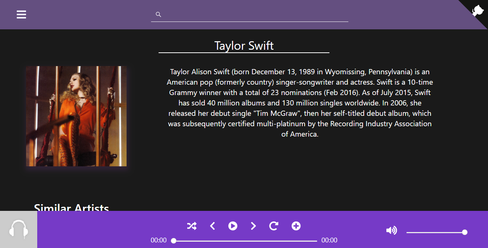

# Euphonize
> Boilerplate and Basic Functioning for WebApp

### https://euphonize-app.firebaseapp.com/
##### Initial start time might be long as I'm using the free tier of Heroku which switches off servers after 30 mins of non use

### Work In Progress

### Data Persistance
- Data persistance is achieved by stroing your playlists in the LocalStorage. 
- ⚠️ Beware if the LocalStorage is cleared your playlists are also cleared.
- To save your playlists permanantly use the Share Playlist option and keep the ID recieved safely.
- These can then be restored anytime you wantvia the ID received

### Screenshots:

### Road Map for `v0.5`:
- [x] Search Bar for Music Search
- [x] Youtube Results
- [x] Media Player
- [x] Flask API with Search and Play Functionality
- [ ] Meta Data Extractor - Last.FM / Itunes
- [ ] Convert to PWA
