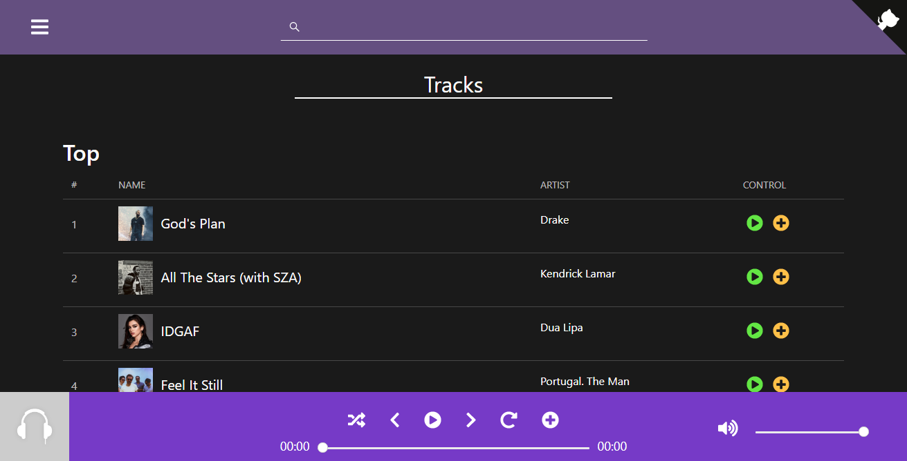
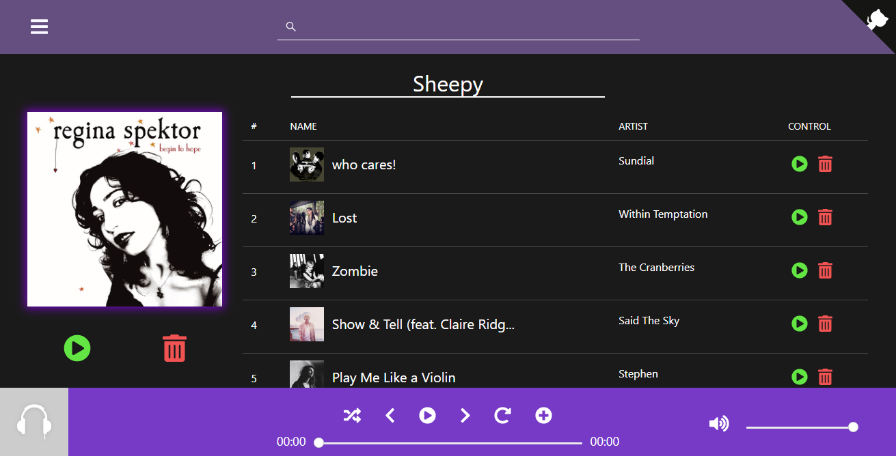

# Euphonize
> Boilerplate and Basic Functioning for WebApp

### https://euphonize-app.firebaseapp.com/
##### Initial start time might be long as I'm using the free tier of Heroku which switches off servers after 30 mins of non use

### Work In Progress

### Screenshots:

### Road Map for `v0.1`:
- [x] Search Bar for Music Search
- [x] Youtube Results
- [x] Media Player
- [ ] Dynamic Audio Switching
- [ ] Meta Data Extractor - Last.FM / Itunes
- [x] Flask API with Search and Play Functionality
- [ ] Convert to PWA
